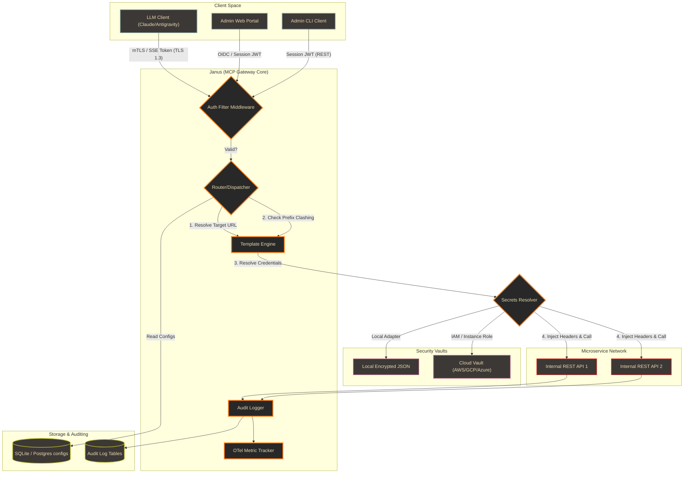
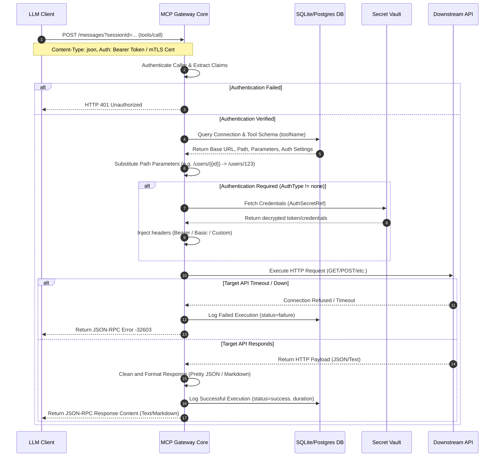
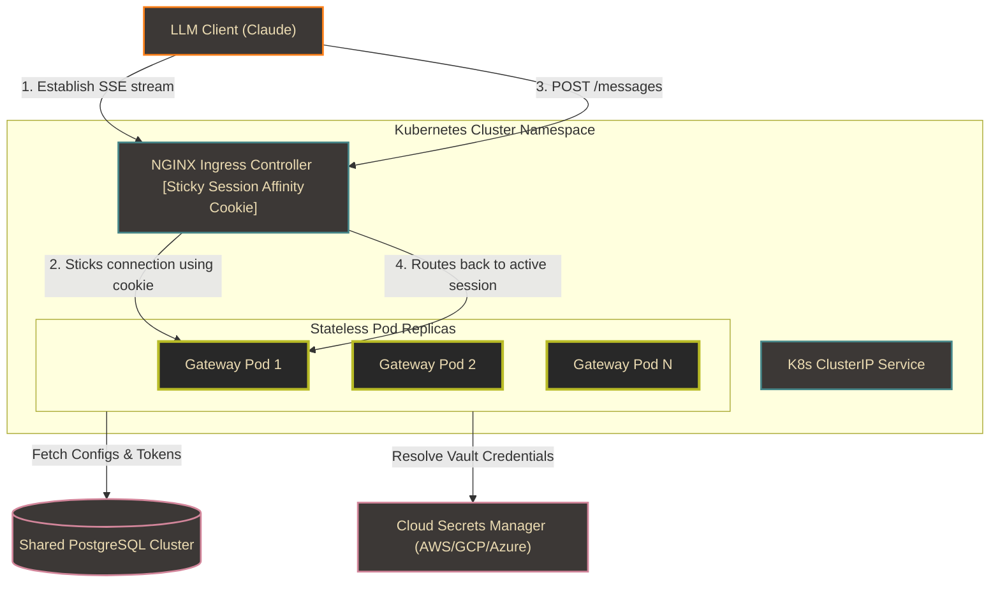

# MCP API Gateway & Portal

An enterprise-grade, high-performance API Gateway and Web Portal that translates standard REST/HTTP APIs into Model Context Protocol (MCP) tools dynamically. Specifically designed for highly secured, regulated, and air-gapped environments.

## Features
- **Dynamic MCP Tool Translation**: Declare connection endpoints and map request body/parameters to JSON Schema templates. The gateway automatically generates MCP-compliant tool definitions.
- **Dual MCP Transports**:
  - **Streamable HTTP** (2025 spec, recommended): stateless `POST /mcp` (or `POST /sse`) — a JSON-RPC request in, the response in the body. No pinned stream, so it **scales across replicas**. Used by Antigravity and by Claude Code (`type: "http"`).
  - **Legacy HTTP+SSE**: `GET /sse` (stream) + `POST /messages`; the response is also pushed back over the SSE stream. Used by clients configured with `type: "sse"`.
- **Enterprise Security** (see [`SECURITY_REVIEW.md`](SECURITY_REVIEW.md)):
  - **Fail-closed config**: `JWT_SECRET` and `GATEWAY_TOKEN` must be ≥32 bytes or the process refuses to start — no usable default secrets.
  - **Authorization, not just authentication**: admin REST APIs are behind role-enforcing middleware (RBAC). Local admin login is enabled only when `ADMIN_PASSWORD` (≥12 chars) is set; otherwise OIDC/SSO only.
  - **SSRF egress guard**: dial-time blocking of private/loopback/link-local addresses and DNS-rebind, plus an optional hostname allowlist.
  - **Token-Authenticated MCP Clients**: scoped client tokens (glob scopes + roles), **hashed at rest** (SHA-256) and shown once. Header-only bearer tokens.
  - **OIDC/OAuth2 SSO** with `state` CSRF + issuer/audience/expiry validation; **mTLS & TLS 1.3**.
  - **Hardened edge**: per-IP rate limiting, HTTP read/write/idle timeouts, request body-size caps.
  - **OAuth 2.1 resource server** *(opt-in, `OAUTH_ENABLED=true`)*: advertises protected-resource metadata at `GET /.well-known/oauth-protected-resource` (RFC 9728), emits `WWW-Authenticate` challenges, and validates audience-bound (RFC 8707) JWT access tokens against the configured authorization servers' JWKS. Coexists with the existing master/client-token auth.
  - **Tool-definition hash pinning** *(rug-pull defense)*: every tool carries a SHA-256 `definitionHash` and a `version` (both surfaced in `tools/list`). With `TOOL_PINNING_STRICT=true`, a call is blocked if the tool's definition changed since it was approved.
  - **PII/secret redaction (DLP)** *(opt-in, `REDACTION_ENABLED=true`)*: masks emails, Luhn-validated credit-card numbers, JWTs, AWS keys, API keys, and IBANs in tool arguments and downstream responses **before they reach the LLM**; redaction events are audit-logged (class + count only, never the value).
- **OpenAPI → MCP import**: turn an OpenAPI 3.x spec (JSON or YAML) into connections, endpoints, and tools in one shot — via `POST /api/import/openapi` (admin) or `mcp-cli import openapi <file|url>` (supports `--dry-run` and `--prefix`).
- **Pluggable Security Vaults**: `local` (**AES-256-GCM encrypted JSON file**, single-node/dev) and `postgres` (**AES-256-GCM encrypted in the shared database** — correct for multi-replica). Both derive their key from `VAULT_ENCRYPTION_KEY` (falling back to `JWT_SECRET`); a pre-existing plaintext `local` file is transparently migrated to ciphertext on first read. `aws`/`gcp`/`azure` **fail closed** until implemented. Connections store only a **reference** (`auth_secret_ref`) — the credential is injected server-side (bearer/basic/custom headers); the LLM never sees it.
- **Scales & self-heals**: stateless gateway on shared PostgreSQL, HorizontalPodAutoscaler (2→10) + PodDisruptionBudget on Kubernetes; short-TTL config/secret/response caches, connection pooling, bounded retries, and `/healthz` + `/readyz` probes (see [`SCALING_AND_CACHING.md`](SCALING_AND_CACHING.md)).
- **Air-Gap Preparedness**: A self-contained Go binary with embedded single-page assets (`//go:embed`), local SQLite for single-node, and OpenTelemetry/Prometheus metrics.

---

## Web Portal Walkthrough

The Janus Web Portal is a premium, secure single-page application built directly into the gateway binary, running locally in a modern dark-mode aesthetic. Here is a visual showcase of the interface:

### 1. Dashboard Overview & Real-Time Telemetry
The main dashboard displays high-level operations metrics, component health diagnostics, request volume counters, and a chronological history of client access tokens.

| Dashboard Console | System Telemetry |
| :---: | :---: |
|  |  |
| *Figure 1: Central gateway monitoring dashboard console.* | *Figure 2: Real-time traffic throughput and database telemetry metrics.* |

---

### 2. Managing Target Connections & MCP Tools
Administrators can register downstream REST targets, isolate them with custom tool prefixes, assign secure credentials from the vault, and map resource routes to MCP schema parameters.

| API Connections | Create Connection |
| :---: | :---: |
|  |  |
| *Figure 3: Registered API connection configurations list.* | *Figure 4: Connection creation form with namespace prefix setup.* |

| MCP Tool Mappings | Configure Dynamic Tool |
| :---: | :---: |
|  |  |
| *Figure 5: Gateway MCP dynamic tool endpoints.* | *Figure 6: Mapping dynamic paths and request body JSON schemas.* |

---

### 3. Security Vaults & Token Scoping
Manage credential stores and issue authorization bearer tokens for LLM clients (Claude, Antigravity, etc.) restricted to specific connection scopes.

| Pluggable Vaults | Scoped Client Tokens |
| :---: | :---: |
|  |  |
| *Figure 7: Vault providers and secret references settings.* | *Figure 8: Issued bearer client tokens list.* |

| Configure Vault Proxy | Issue Client Token |
| :---: | :---: |
|  |  |
| *Figure 9: Setting credential mapping endpoints.* | *Figure 10: Generating client tokens with restricted scope.* |

---

### 4. Interactive OpenAPI & Swagger Documentation
The gateway automatically aggregates all dynamic tool endpoint parameters into a unified OpenAPI/Swagger schema, enabling interactive developer testing directly in the portal.

| OpenAPI Schema Preview | Swagger UI Endpoints |
| :---: | :---: |
|  |  |
| *Figure 11: Real-time Swagger JSON spec modal.* | *Figure 12: Interactive Swagger UI explorer.* |


*Figure 13: Live Swagger UI explorer for schema definitions and execution verification.*

---

### 5. Audit Logging & Built-in Guides
A complete compliance audit trail records all tool executions and changes, accompanied by built-in interactive guides for quick onboarding.

| Historical Audit Logs | Developer Guides |
| :---: | :---: |
|  |  |
| *Figure 14: Historical compliance audit trail.* | *Figure 15: Embedded client integration instructions.* |

---

## Technical Architecture



### Detailed Execution Sequence

Here is the exact sequence of validation, vault credentials resolution, routing execution, and metric audits during a single MCP tool call:



---

## Quick Start

### 1. Using Nix & Devenv
The repository comes equipped with a declarative Nix Flake and a `devenv` shell environment.

To activate the development shell:
```bash
# Allow direnv to auto-enter shell
direnv allow

# Or enter manually using devenv
devenv shell
```

Available scripts inside the devenv shell:
- `run-dev`: Starts the gateway web portal on `http://localhost:8080` (or https depending on configuration).
- `build`: Compiles the binary to `./mcp-gateway`.
- `lint`: Runs Golangci-lint checking rules.
- `test`: Executes backend unit tests.

### 2. Using Docker Compose
Run the stack using the pre-configured compose setup:
```bash
docker-compose up -d --build
```
This builds the multi-stage production container, mounts a persistent volume for the local SQLite file (`secrets.json` and `mcp-gateway.db`), and exposes the UI at `http://localhost:8080`.

---

## Operating Modes

### A. Server Mode (Portal & SSE) - Default
Exposes the web configuration dashboard (Portal) and the Server-Sent Events (SSE) stream listener. 

To run:
```bash
go run main.go
```

**SSO Configuration**: Set the following environment variables to activate OIDC:
- `OIDC_ISSUER`: Issuer URL (e.g. `https://keycloak.company.com/realms/internal`)
- `OIDC_CLIENT_ID`: OAuth client identifier
- `OIDC_CLIENT_SECRET`: OAuth client secret token

**SSL/TLS & mTLS Configuration**:
- `TLS_CERT_PATH`: Path to server certificate PEM.
- `TLS_KEY_PATH`: Path to server private key PEM.
- `CLIENT_CA_PATH`: Path to CA bundle (activates Mutual TLS).

### B. Stdio Mode (CLI Wrapper)
Used by local desktop clients (like Claude Desktop) to invoke tools through stdin/stdout.

To configure Claude Desktop to use this gateway:
Add the following connection to `claude_desktop_config.json`:
```json
{
  "mcpServers": {
    "api-gateway": {
      "command": "/path/to/mcp-gateway",
      "args": ["-stdio"],
      "env": {
        "DATABASE_PATH": "/path/to/mcp-gateway.db",
        "VAULT_PROVIDER": "local",
        "VAULT_LOCAL_PATH": "/path/to/secrets.json"
      }
    }
  }
}
```

---

## Connecting MCP Clients (remote)

For the deployed gateway, point clients at the HTTP(S) endpoint with a bearer token (the master `GATEWAY_TOKEN` for admin/`*`, or a scoped client token).

**Claude Code** — `.mcp.json` in the project root, using the stateless Streamable HTTP transport:
```json
{
  "mcpServers": {
    "janus-gateway": {
      "type": "http",
      "url": "https://<gateway-host>/mcp",
      "headers": { "Authorization": "Bearer ${JANUS_GATEWAY_TOKEN}" }
    }
  }
}
```

**Antigravity** — register the server in Antigravity's MCP config (`~/.gemini/antigravity/mcp_config.json`; it does **not** read a repo-local file). Antigravity uses Streamable HTTP against `/sse`:
```json
{ "mcpServers": { "janus-gateway": {
  "serverUrl": "https://<gateway-host>/sse",
  "headers": { "Authorization": "Bearer <token>" } } } }
```

Legacy `type: "sse"` clients also work (`GET /sse` + `POST /messages`); prefer `/mcp` for multi-replica.

---

## Demos

The repo ships two end-to-end demos (via `just`) that drive real LLM agents against the **live** gateway and generate a governed financial report. Both aggregate LCH collateral + US Treasury + **Bank of England** + **ECB FX** + **Eurostat** through the single gateway and consolidate a multi-currency portfolio into a GBP value (~£36.39M). A sample output is committed at [`doc/sample_crosscurrency_collateral_report.md`](doc/sample_crosscurrency_collateral_report.md).

| Recipe | Script | Agent | What it does |
| :--- | :--- | :--- | :--- |
| `just demo-claude` | `scripts/demo_janus_claude.sh` | Claude Code (`claude -p`) | Loads janus via `.mcp.json` (`/mcp`) and produces a **Cross-Currency Collateral Valuation & Multi-Jurisdiction Rate Audit** for member `MEM-LCH-002`. |
| `just demo-antigravity` | `scripts/demo_janus_mcp.sh` | Antigravity (`agy --print`) | Runs the `lch-collateral-reporting` skill (in `.agents/skills/`) to produce the same report. |
| `just mcp-config-claude` | — | — | Prints the Claude Code MCP config (`.mcp.json`). |

**Prerequisites & notes**
- **Claude demo**: the `claude` CLI + a claude.ai subscription. The script **unsets `ANTHROPIC_API_KEY`** so it uses the subscription (not the pay-as-you-go API key). Override the gateway token with `JANUS_GATEWAY_TOKEN=... just demo-claude`.
- **Antigravity demo**: the `agy` CLI, with `janus-gateway` registered in `~/.gemini/antigravity/mcp_config.json`. The skill lives in `.agents/skills/lch-collateral-reporting/`.
- Both are **billable** LLM runs (five tool calls each). They print the generated report to stdout.

---

## Configuration Settings

Configure the gateway using standard environment variables. A full template is in [`.env.example`](.env.example).

**Required (fail-closed — the process refuses to start without them):**

| Variable | Purpose |
| :--- | :--- |
| `JWT_SECRET` | Signs portal JWT sessions. **Must be ≥32 bytes.** |
| `GATEWAY_TOKEN` | Master bearer token for MCP clients (→ admin/`*`). **Must be ≥32 bytes.** |

**Core / storage / vault:**

| Variable | Default | Purpose |
| :--- | :--- | :--- |
| `PORT` | `8080` | Port for the Web Portal and MCP endpoints. |
| `DATABASE_PATH` | `./mcp-gateway.db` | Local SQLite file. |
| `DATABASE_URL` | `""` | PostgreSQL URI (`postgres://…`). Overrides `DATABASE_PATH`; required for multi-replica. |
| `VAULT_PROVIDER` | `local` | `local`, `postgres` (implemented) or `aws`/`gcp`/`azure` (fail closed). |
| `VAULT_LOCAL_PATH` | `./secrets.json` | JSON vault file (provider `local`). |
| `VAULT_ENCRYPTION_KEY` | *(falls back to `JWT_SECRET`)* | AES-256-GCM key source for the `local` **and** `postgres` vaults. |

**Auth / SSO / TLS:**

| Variable | Default | Purpose |
| :--- | :--- | :--- |
| `ADMIN_USERNAME` / `ADMIN_PASSWORD` | `admin` / *(empty)* | Local admin login. Disabled unless password (≥12) is set. |
| `OIDC_ISSUER` / `OIDC_CLIENT_ID` / `OIDC_CLIENT_SECRET` | `""` | OpenID Connect SSO. |
| `OIDC_DEFAULT_ROLE` | `admin` | Role granted to SSO users. |
| `PUBLIC_BASE_URL` | `""` | Public URL used to build the OIDC redirect URI. |
| `TLS_CERT_PATH` / `TLS_KEY_PATH` / `CLIENT_CA_PATH` | `""` | HTTPS cert/key; CA bundle activates **mTLS**. |
| `TLS_TERMINATED_AT_PROXY` | `false` | Set when TLS is terminated upstream (e.g. an nginx ingress) rather than by this pod, so the portal reports the deployment's TLS posture correctly. |
| `MTLS_MODE` | `off` | `off`, `optional`, or `required` — mutual-TLS enforcement, whether enforced in-pod or by an upstream proxy/ingress. See [TLS & mTLS](#tls--mtls) below. |

**Security policy / performance / demo:**

| Variable | Default | Purpose |
| :--- | :--- | :--- |
| `EGRESS_ALLOWLIST` | `""` | Comma-separated downstream hostname allowlist (empty = any public host). |
| `EGRESS_ALLOW_PRIVATE` | `false` | Permit calls to private/loopback ranges (local/demo only). |
| `CORS_ALLOWED_ORIGINS` | `""` | Allowed SSE/CORS origins (empty = none). |
| `METRICS_TOKEN` | `""` | Bearer token to scrape `/metrics` (empty = open). |
| `CONFIG_CACHE_TTL` / `SECRET_CACHE_TTL` / `RESPONSE_CACHE_TTL` | `5s` / `30s` / `0` | TTLs for topology / secret / idempotent-GET caches. |
| `DB_MAX_OPEN_CONNS` / `DB_MAX_IDLE_CONNS` | `25` / `10` | DB connection pool. |
| `DOWNSTREAM_RETRIES` | `2` | Bounded retries (backoff) for idempotent downstream calls. |
| `SEED_DEMO_DATA` | `false` | Seed demo connections/tools on first boot. |

**OAuth 2.1 resource server** *(all off unless `OAUTH_ENABLED=true`):*

| Variable | Default | Purpose |
| :--- | :--- | :--- |
| `OAUTH_ENABLED` | `false` | Enable the OAuth 2.1 resource-server surface (metadata endpoint, `WWW-Authenticate` challenges, JWKS-based token validation). Existing master/client-token auth still works. |
| `OAUTH_RESOURCE_URI` | `""` | This gateway's resource identifier, advertised in the protected-resource metadata and required as the token audience (RFC 8707). |
| `OAUTH_AUTHORIZATION_SERVERS` | `""` | Comma-separated authorization-server issuer URLs whose JWKS are trusted to sign access tokens. |
| `OAUTH_SCOPES_SUPPORTED` | `""` | Comma-separated scopes advertised in the protected-resource metadata. |

**Tool pinning & redaction (DLP)** *(off by default):*

| Variable | Default | Purpose |
| :--- | :--- | :--- |
| `TOOL_PINNING_STRICT` | `false` | Block a `tools/call` when the tool's `definitionHash` no longer matches the approved definition (rug-pull defense). Hashes/versions are surfaced in `tools/list` regardless. |
| `REDACTION_ENABLED` | `false` | Mask PII/secrets (emails, Luhn-validated cards, JWTs, AWS keys, API keys, IBANs) in tool arguments and downstream responses before they reach the LLM; events are audit-logged as class + count only. |

### TLS & mTLS

On the live EKS deployment, TLS is terminated at the nginx ingress (cert-manager,
`ClusterIssuer letsencrypt-prod`), not by the gateway pod itself — `TLS_TERMINATED_AT_PROXY=true`
tells the portal to reflect that instead of misreporting an ingress-terminated deployment
as unencrypted. `MTLS_MODE` (`off` / `optional` / `required`) separately reports the
mutual-TLS posture, whether mTLS is enforced in-pod (via `TLS_CERT_PATH` / `TLS_KEY_PATH` /
`CLIENT_CA_PATH`) or by an upstream proxy/ingress verifying client certs on the gateway's
behalf.

Client-certificate mTLS is **off by default** and is not required for normal MCP client
use (bearer token / JWT auth keeps working regardless). To enable **optional** mTLS at
the ingress — so clients that do present a cert get verified, without breaking existing
token-only clients — follow the runbook in
[`deployment/mtls/README.md`](deployment/mtls/README.md).

---

## Importing an OpenAPI spec

Bootstrap a connection and its tools from an existing OpenAPI 3.x document (JSON or YAML) instead of registering endpoints by hand.

**Via the admin REST API** (JWT + admin role):
```bash
curl -X POST https://<gateway-host>/api/import/openapi \
  -H "Authorization: Bearer <admin-jwt>" \
  -H "Content-Type: application/json" \
  -d '{"url": "https://api.example.com/openapi.json", "prefix": "example_"}'
```

**Via the CLI** (`--dry-run` previews the generated connection/tools without writing; `--prefix` namespaces the tools):
```bash
# From a local file
mcp-cli import openapi ./petstore.yaml --prefix petstore_ --dry-run

# Or straight from a URL
mcp-cli import openapi https://api.example.com/openapi.json --prefix example_
```

---

## Administrative & Monitoring CLI (`mcp-cli`)

For administrators and operators, the gateway includes a standalone, cross-platform CLI tool (`mcp-cli`) compiled for macOS (Intel/Apple Silicon), Linux, and Windows. The CLI connects remotely to the Gateway REST API over HTTPS/HTTP, providing complete administration, verification, and performance monitoring capabilities.

### 1. Build Instructions
To build the CLI for your current platform:
```bash
just build-cli
```
To cross-compile for all systems (outputs saved in `dist/`):
```bash
just build-cli-all
```

### 2. Available Commands

* **Authentication**:
  ```bash
  mcp-cli login <username> --addr <gateway-url>
  ```
  Authenticates with the gateway server and caches the session token in the user configuration directory (`~/.config/mcp-gateway/cli.json`).

* **Diagnostics & Verification**:
  ```bash
  mcp-cli verify
  ```
  Runs a comprehensive health check: pings the gateway server, verifies database schemas, checks vault integration, and validates outbound network connectivity for all downstream API endpoints.

* **Performance & Telemetry Monitoring**:
  ```bash
  mcp-cli status    # Shows gateway settings, active port, vault provider, and mTLS status
  mcp-cli metrics   # Fetches and parses scrapable Prometheus metrics for live status tracking
  mcp-cli logs      # Lists the last 100 tool execution audit logs (status, duration, error messages)
  ```

* **API Connections CRUD**:
  ```bash
  mcp-cli connection list
  mcp-cli connection add --name <name> --url <url> [--prefix <prefix>] [--auth <type>] [--secret <ref>]
  mcp-cli connection modify --id <uuid> [--name <name>] [--url <url>] [--prefix <prefix>] [--enabled <true|false>]
  mcp-cli connection delete --id <uuid>
  ```

* **Tool Endpoints CRUD**:
  ```bash
  mcp-cli endpoint list
  mcp-cli endpoint add --conn-id <conn-uuid> --name <tool-name> --desc <description> --path <route> --method <HTTP-method>
  mcp-cli endpoint modify --id <endpoint-uuid> [--name <name>] [--path <route>] [--method <HTTP-method>]
  mcp-cli endpoint delete --id <endpoint-uuid>
  ```

* **Vault Secrets Management**:
  ```bash
  mcp-cli vault list
  mcp-cli vault set --key <secret-path> --val <secret-value>
  mcp-cli vault delete --key <secret-path>
  ```

* **OpenAPI Import** (generate connection + endpoints/tools from an OpenAPI 3.x spec):
  ```bash
  mcp-cli import openapi <file|url> [--prefix <prefix>] [--dry-run]
  ```

---

## Integrating with Secret Vaults

Sensitive auth tokens are retrieved at query runtime from your chosen vault. The connection stores only a **reference** (`auth_secret_ref`) — the gateway resolves it and injects the credential server-side, so the LLM never sees it. Rotate the secret in the vault and every tool using it updates instantly.

| Provider (`VAULT_PROVIDER`) | Status | Storage |
| :--- | :--- | :--- |
| `local` | ✅ Implemented | **AES-256-GCM encrypted** JSON file (`VAULT_LOCAL_PATH`) — single-node/dev. Any pre-existing plaintext file is migrated to ciphertext once, on first read. |
| `postgres` | ✅ Implemented | **AES-256-GCM encrypted** in the shared PostgreSQL DB — correct for multi-replica |
| `aws` / `gcp` / `azure` | ⛔ Fail closed | Not yet implemented — refuses to start (never returns fake secrets) |

> Both encrypting vaults derive their key from `VAULT_ENCRYPTION_KEY`, falling back to `JWT_SECRET` if it is unset.

**Per-connection `auth_type`** — how the gateway injects the resolved secret:

| `auth_type` | Header injected | Vault secret format | Example |
| :--- | :--- | :--- | :--- |
| `none` | — | — | Public APIs (BoE, ECB, Eurostat…) |
| `bearer` | `Authorization: Bearer <secret>` | the token | OAuth/token APIs |
| `basic` | HTTP Basic | `user:pass` | **UK Companies House** = `<APIKEY>:` |
| `custom_headers` | arbitrary headers | JSON map | **FCA register** = `{"X-Auth-Email":"…","X-Auth-Key":"…"}` |

> Known limitation: credentials are injected as **headers** only. APIs that require the key as a **query parameter** need a small future `query_param` auth type — most APIs offer an `X-API-Key` header alternative (use `custom_headers`).

### Storing a Secret
In the Portal **Security Vault** view (or `POST /api/vault`), insert the secret mapping, then set the connection's `Auth Secret Ref` to that key:
- **Secret Path**: `prod/billing-service/api-key`  →  **Secret Value**: the raw token/credential.

---

## Real-Life Scenarios

### Scenario A: Securing legacy REST APIs inside a regulated bank

In this scenario, a banking SRE team needs to expose internal customer account databases to developers using Claude Desktop, without revealing target credentials.

#### 1. Setup the connection target
Register the internal accounts database via the command line client:
```bash
# Add connection target
./mcp-cli connection add \
  --name "Accounts Database" \
  --url "https://internal.bank.net/api/v1" \
  --prefix "accounts_" \
  --desc "Protected customer banking records database" \
  --auth "bearer" \
  --secret "prod/database/accounts-key"
```

#### 2. Store the credentials securely in the vault
Write the API authorization token into the configured Vault (resolving at execution time):
```bash
./mcp-cli vault set \
  --key "prod/database/accounts-key" \
  --val "sk_secure_banking_token_558839"
```

#### 3. Define the tool endpoint mapping
Expose a specific, restricted endpoint as a structured MCP tool:
```bash
./mcp-cli endpoint add \
  --conn-id "<connection-uuid>" \
  --name "get_balance" \
  --desc "Retrieve checking and savings balances for a client ID" \
  --path "/balance/{{client_id}}" \
  --method "GET" \
  --schema '{"type":"object","properties":{"client_id":{"type":"string","description":"Client account identifier"}},"required":["client_id"]}'
```

---

### Scenario B: Dynamic image and media formatting for LLM users

LLMs like Claude, Antigravity, and Copilot render standard Markdown directly in their chat UIs. Here is how we expose dynamic image generation services for users.

#### 1. Register a public image generator API
Add the public Dog CEO API connection:
```bash
./mcp-cli connection add \
  --name "Dog Ceo Pictures" \
  --url "https://dog.ceo/api" \
  --prefix "dog_" \
  --desc "Generates random breed photos and dog images" \
  --auth "none"
```

#### 2. Register the random image endpoint
```bash
./mcp-cli endpoint add \
  --conn-id "<dog-connection-uuid>" \
  --name "random_image" \
  --desc "Fetch a random dog picture URL" \
  --path "/breeds/image/random" \
  --method "GET"
```

#### 3. Query the tool in real life
When an LLM client runs the tool `dog_random_image`, it receives the JSON response:
```json
{
  "message": "https://images.dog.ceo/breeds/terrier/n02093754_3839.jpg",
  "status": "success"
}
```
The LLM client automatically processes the image URL, translating it to a standard Markdown tag:
```markdown
Here is the random dog image:

```
The user's chat client renders the dog picture inline immediately.

---

### Scenario C: Component Health and Live Performance Telemetry

Administrators must verify the status and monitor performance loads of the gateway under usage.

#### 1. Check Server Component Diagnostics
Run the command-line diagnostic suite to verify routing integrity:
```bash
./mcp-cli verify
```
*Verification output:*
```text
Running Gateway Component Diagnostics...
=========================================
[1/5] Checking Gateway Server Connectivity... OK
[2/5] Verifying Admin Credentials Token...    OK (Token Verified)
[3/5] Querying System Database Schema...     OK (3 Connections, 6 Tools Registered)
[4/5] Testing Vault Secret Integration...    OK (1 Secret Keys Available)
[5/5] Verifying Target API Connectivity...   
  Name                  Target URL               Status   Notes
  ----                  ----------               ------   -----
  Accounts Database     https://internal.bank... OK       HTTP 401 Unauthorized
  Dog Ceo Pictures      https://dog.ceo/api      OK       HTTP 200 OK
```

#### 2. Query Live Prometheus Telemetry
Scrape system telemetry stats directly from the active exporter stream:
```bash
./mcp-cli metrics
```
*Sample metrics payload:*
```text
MCP Gateway Monitoring Telemetry Stats
======================================
Metric Identifier                   Labels / Tags                                     Value
-----------------                   -------------                                     -----
mcp_tool_execution_count_total      status="success",tool_name="dog_random_image"     18
mcp_tool_execution_latency_seconds  quantile="0.9",tool_name="accounts_get_balance"   0.142
go_memstats_alloc_bytes             -                                                 8234810
```

---

### Scenario D: Enterprise API Restriction & Scoped Client Access

In enterprise environments, different development teams or LLM agents require restricted access to specific APIs only. We configure role-based access controls and scope globs to isolate client tokens.

#### 1. Issue a Scoped Client Token via CLI
Generate and register a token restricted only to weather APIs (tools prefixing with `weather_`):
```bash
./mcp-cli token add \
  --name "Weather Team Token" \
  --token "mcp_client_weather_dev_552" \
  --role "developer" \
  --scopes "weather_*"
```

Alternatively, this can be done visually in the **Client Tokens** section of the Web Portal, featuring a secure token generator.

#### 2. Verify Scoped Access in Stdio/SSE Client
When a client connects using the token `mcp_client_weather_dev_552`, they only see tools matching the `weather_*` pattern.

Query tools over Stdio:
```bash
export MCP_GATEWAY_TOKEN=mcp_client_weather_dev_552
echo '{"jsonrpc":"2.0","method":"tools/list","id":1}' | ./mcp-gateway -stdio
```
*Response payload:*
```json
{
  "jsonrpc": "2.0",
  "result": {
    "tools": [
      {
        "name": "weather_get_forecast",
        "description": "Retrieve real-time weather and forecast data for coordinates",
        "inputSchema": {
          "properties": {
            "current_weather": { "type": "boolean" },
            "latitude": { "type": "number" },
            "longitude": { "type": "number" }
          },
          "required": ["latitude", "longitude"],
          "type": "object"
        }
      }
    ]
  },
  "id": 1
}
```
All other connections (e.g. `stripe_*`) and administrative tools (e.g. `admin_*`) are filtered out completely from the listing and rejected with a standard JSON-RPC `-32601` error code if called directly.

---

### Scenario E: High-Availability Scale-Out in Kubernetes Cluster

For production workloads, the gateway server is deployed as multiple stateless replicas inside a Kubernetes cluster behind an Ingress controller configured with session affinity.

#### 1. Kubernetes Architecture & Traffic Flow
Below is the architectural diagram of a scaled-out Kubernetes deployment:



#### 2. Deploy Stateless Pods with PostgreSQL
The live reference deployment (AWS EKS cluster `sarc-aws`, namespace `janus`) runs the **stateless gateway on an in-cluster PostgreSQL** (`janus-db`), with the DB URL in the `mcp-gateway-secrets` Secret. Manifests are split by lifecycle:

```bash
# One-time (out-of-band): namespace, secret, Postgres, HPA + PDB
kubectl create namespace janus
kubectl apply -f k8s/janus-db.yaml        # in-cluster Postgres
kubectl apply -f k8s/janus-scaling.yaml   # HorizontalPodAutoscaler (2->10) + PodDisruptionBudget

# Per release (CI-applied): the stateless gateway Deployment/Service/Ingress
kubectl apply -f k8s-janus.yaml
```
The gateway Deployment **omits `replicas`** — the HPA owns the count. Because state lives in Postgres (config, tokens, audit, and the AES-encrypted vault), pods are fully stateless. CI/CD deploys via GitHub Actions using **GitHub OIDC** (the `AWS_DEPLOY_ROLE_ARN` repo variable — no stored keys); see [`deployment/GITHUB_OIDC_SETUP.md`](deployment/GITHUB_OIDC_SETUP.md).

#### 3. Transport & session routing
- **Streamable HTTP (`/mcp`) is stateless** — any replica serves any request, so scale-out needs no session affinity. This is the recommended transport for multi-replica.
- The **legacy `GET /sse` + `POST /messages`** transport is stateful (the stream is pinned to one pod). For it, the NGINX Ingress inserts a `route` cookie so the POST lands on the same pod. Clients that don't carry the cookie should use `/mcp` instead.

---

### Scenario F: LCH Group clearing + multi-jurisdiction market data

With `SEED_DEMO_DATA=true`, the gateway seeds a governed, multi-source demo used by the `just` demos above. Tools exposed:

| Prefix | Source | Auth | Example tool |
| :--- | :--- | :--- | :--- |
| `lch_` | LCH mock (DPG trade volume, non-cash collateral) | none | `lch_get_non_cash_collateral` |
| `ustreasury_` | U.S. Treasury Fiscal Data | none | `ustreasury_get_avg_interest_rates` |
| `coinbase_` | Coinbase Exchange | none | `coinbase_get_btc_stats` |
| `boe_` | **Bank of England** (Bank Rate) | none | `boe_get_bank_rate` |
| `fx_` / `ecb_` | **ECB** euro reference rates (Frankfurter / Data Portal) | none | `fx_get_reference_rates` |
| `eurostat_` | **Eurostat** (HICP inflation) | none | `eurostat_get_hicp_inflation` |
| `ons_` | **UK ONS** | none | `ons_list_datasets` |
| `vaultdemo_` | httpbin (bearer via vault) | **vault** | `vaultdemo_check_auth` |

> Client tokens are **not seeded** (the old hardcoded token was removed for security). Use the master `GATEWAY_TOKEN` for admin/`*` access, or create a scoped token in the Portal → **Client Tokens** (`POST /api/tokens`).

#### 1. Out-of-the-Box Simulated Targets
The LCH mock exposes two downstream endpoints under `http://127.0.0.1:<port>/api/mock`:
* `/dpg/trade-volume`: Daily trade volumes and currency breakdown.
* `/collateral/non-cash`: ISIN listings and valuations.

#### 2. Querying via REST API
LCH applications can query data directly over standard HTTP/REST:
```bash
# Query daily trade volume
curl http://localhost:8899/api/mock/dpg/trade-volume?member_id=MEM-LCH-001

# Query non-cash collateral asset breakdown
curl http://localhost:8899/api/mock/collateral/non-cash?member_id=MEM-LCH-001
```

#### 3. Invoking via MCP Facade
LLM clients communicate over Stdio or the HTTP transports using a client token (the master `GATEWAY_TOKEN`, or a scoped token issued in the Portal):
```bash
export MCP_GATEWAY_TOKEN="$GATEWAY_TOKEN"   # or a scoped client token
echo '{"jsonrpc":"2.0","method":"tools/call","params":{"name":"lch_get_dpg_trade_volume","arguments":{"member_id":"MEM-LCH-001"}},"id":1}' | ./mcp-gateway -stdio
```
The gateway parses the parameter `member_id`, forwards the query to the underlying REST service, validates outputs, and returns clean, structured data to the client.

---

## File Structure
- `main.go`: Application lifecycle, HTTP wiring, middleware (rate-limit, body-limit, `/healthz`, `/readyz`).
- `pkg/config`: Fail-closed configuration loading and validation.
- `pkg/storage`: SQLite/Postgres connector, CRUD, audit logs, hashed client tokens, short-TTL caches.
- `pkg/vault`: `local` (AES-256-GCM file) and `postgres` (AES-256-GCM) vaults; cloud providers fail closed.
- `pkg/auth`: JWT (audience/issuer), RBAC middleware, OIDC, TLS/mTLS profiles.
- `pkg/gateway`: Template rendering, SSRF egress guard, secret/response caches, retries, HTTP execution.
- `pkg/mcp`: MCP JSON-RPC — Streamable HTTP (`/mcp`) + legacy HTTP+SSE (`/sse`, `/messages`).
- `pkg/portal`: Admin REST API, OIDC/local login, OpenAPI, embedded SPA (`static/`).
- `pkg/cache`: Generic dependency-free TTL cache.
- `pkg/telemetry`: OpenTelemetry + Prometheus metrics.
- `k8s-janus.yaml`, `k8s/janus-db.yaml`, `k8s/janus-scaling.yaml`: Kubernetes manifests (see Scenario E).
- `SECURITY_REVIEW.md`, `SCALING_AND_CACHING.md`, `deployment/GITHUB_OIDC_SETUP.md`: security, scaling, and deploy docs.
